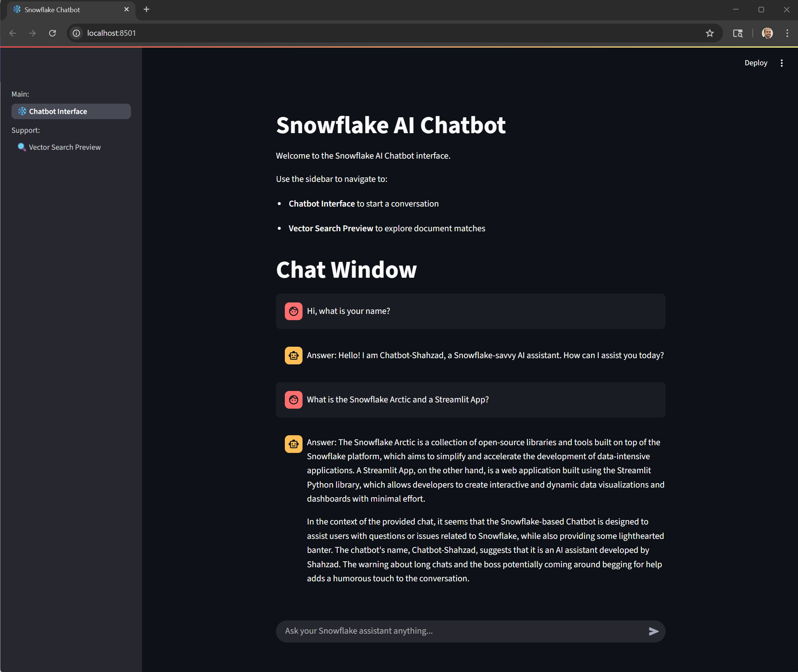

# :snowflake: Snowflake AI Chatbot :dependabot: with RAG using Streamlit + Cortex (Snowflake Arctic)
A lightweight chatbot application built using Streamlit and powered by Snowflake Arctic.  This chatbot supports conversations and logs all interactions in Snowflake.  It also supports context management using RAG.

---

## Author
Shahzad Asif - AI/ML Solutions Architect

## Contribution Channel
For comments or questions, please open an issue.

---

## Project Structure
```
root/
|__ app.py                      - Main Streamlit app
|__ requirements.txt            - PIP requirements to install the dependencies
|
|
|__ database/                    - Folder containing database setup scripts :important: Execute in Snowflake
|____ dbsetup.sql                -- Create warehouse, database, and schema
|____ chatmemory-tbl.sql         -- Create CHAT_MEMORY table to log chats
|____ documentvectors-tbl.sql    -- Create DOCUMENT_VECTORS table to store embeddings from any documents provided for Retrieval Augmented Generation (RAG)
|
|
|__ data/                        - Folder to be used for uploading PDFs and TXT files to provide RAG context
|
|
|__ utils/                       - Folder containing all utilities for this application
|____ common_utils.py            -- Common functions, for example creating the connection_params
|____ cortex_utils.py            -- Functions to support Snowflake Cortex interactions, like session SQL operations to call COMPLETE
|____ rag_utils.py               -- Functions to perform RAG operations, like generating embeddings, querying for similar embeddings, injecting context to prepare prompt
|
|
|__ scripts/                     - Folder containing scripts to load some sample embeddings and process any documents (PDFs or TXT) available in data folder
|____ batch_embed_files.py       -- Script to chunck, embed, and store from data folder
|____ load_embeddings.py         -- Script to load some sample embeddings
|
|
|__ streamlit_pages/             - Folder containing Streamlit pages for the application
|____ 1_chatbot_interface.py     -- Chatbot Interface
|____ 2_vector_search_preview.py -- Tool for querying existing embeddings using NLP
|
|
|__ README.md
|__ pyproject.toml               -- Project definition and dependencies
|__ .python-version
```
---
## How to use this Repo
__NOTE:__ Assuming you have UV installed, we will create a new virtual environment for this project and use that Python interpreter for our work.

If you need to understand how to install UV, you can follow the details on the following link:
https://www.datacamp.com/tutorial/python-uv

1. Clone the repo to a local folder.

2. Open the folder in VS Code.

3. Open a new Terminal window.

4. Next, we will initialize UV within our folder.  This is only required the first time.
```bash
uv init .
```
5. Once the project is initialized with UV, we are ready to create a new virtual environment.  This is normally a one-time step as well. 

However, if you notice issues with your existing virtual environment, then just **deactivate** the environment, and delete the .venv folder within this project.  Then, you can continue from this step forward.

```bash
uv venv 
```
This step creates the new environment and a .venv folder is added to this project directory.

6. Next, we will activate the virtual environment.  Use the following command:
```bash
.venv\Scripts\activate
```
Once activated, you will notice the folder name is prefixed to the command prompt.

7. Next, install all the dependencies as defined by this project.  These are only installed within this virtual environment and do not affect the global environment within your machine.
```bash
uv pip install -r requirements.txt
```
8. Next, we need to setup the Snowflake secrets for the Snowflake connection.
---
## Setup the Snowflake secrets in your local environment
1. Create a new subfolder and file as follows:
```code
sf-streamlit-chatbot (project folder)/
|
|__ .streamlit\
|____ secrets.toml
```
2. Modify the **secrets.toml** to include the following secrets:
```json
account = "<your Snowflake (SF) account>"
user = "<SF username>"
authenticator = "externalbrowser"
password = "<SF user password>"
database = "DS_DEV_DB"
schema = "DS_DEV_CHAT"
warehouse = "DS_DEV_WH"
role = "<SF role assigned to the user>"
```
You can find these secrets by logging into Snowflake.  Click your logged-in user to the account settings and view the Account Details.  The information can be easily copied from Config File tab.

3. Next, use a Worksheet to copy and execute the SQL scripts using the following order:

    a. dbsetup.sql
    b. documentvectors-tbl.sql
    c. chatmemory-tbl.sql

4. In the project folder, you will need to setup your debug environment.  Under the **.vscode** folder in VS Code, create a new file **launch.json** and copy the following setup:
```json
{
  "version": "0.2.0",
  "configurations": [
    {
      "name": "Streamlit: Run app.py",
      "type": "debugpy",
      "request": "launch",
      "program": "${workspaceFolder}\\.venv\\Scripts\\streamlit.exe",  // adjust path for venv
      "args": [
        "run",
        "app.py"
      ],
      "console": "integratedTerminal"
    }
  ]
}
```

5. Now, your environment is configured to run the Streamlit application and debug locally as needed.

---
# Snapshots from this Snowflake Chatbot
Here is an example instance of this application.  The chatbot is using Snowflake Arctic LLM. When prompted to explain some terms of Snowflake, it used the RAG documents that are loaded in DOCUMENT_VECTORS table and responds accordingly.

